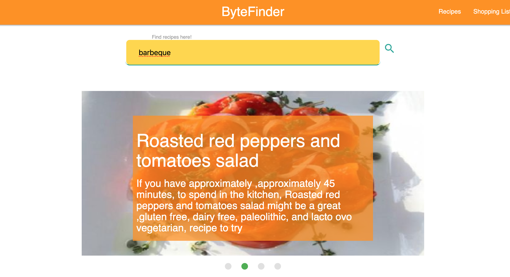
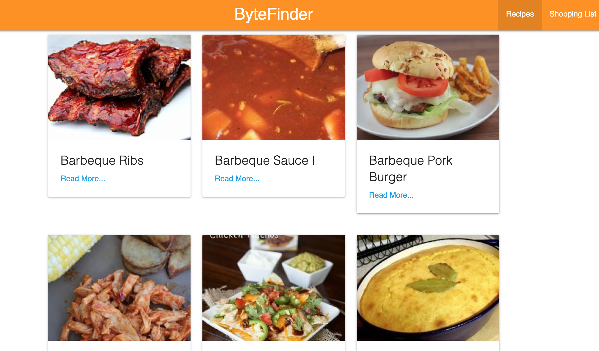
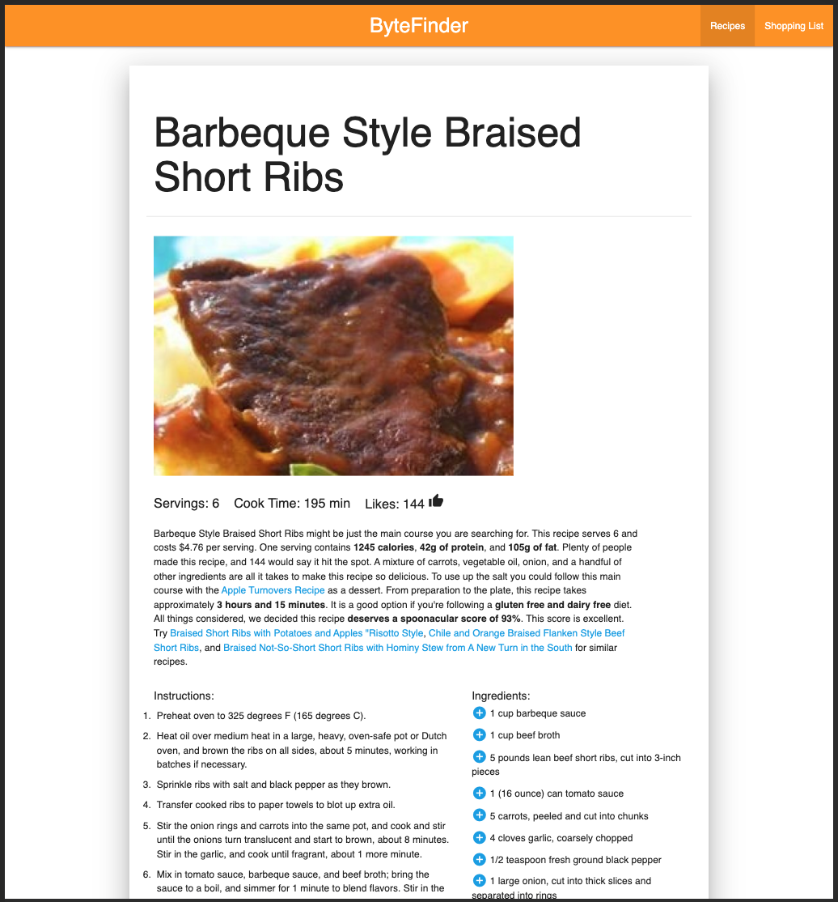
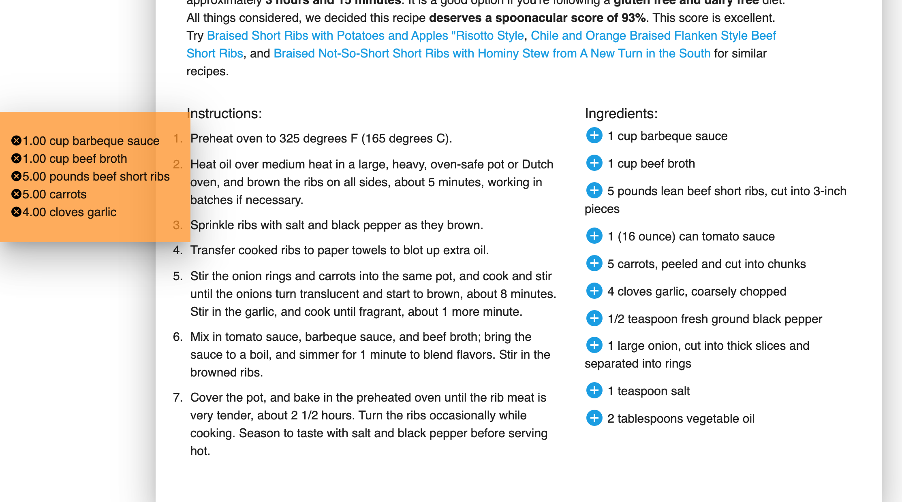
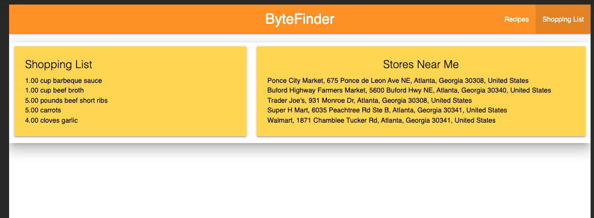

# Project1 - ByteFinder

ByteFinder is a website for searching recipes, making shopping lists, and finding near-by stores

https://logantwalker.github.io/Project-01-ByteFinder/index.html

## Searching for Recipes



single term searches work the best with this API

## Viewing Search Results



12 search results are rendered. Press 'Read More...' to see recipe information.

## Recipe Information Page



Recipe stats, summary, instructions, and ingredients are displayed here

## Adding Ingredients to Your List



press the add button to add an ingredient to the list. the sidebar shows what you have in you list
the cancel button on the sidebar removes the item next to it.

## View Your Shopping List and Near-By Stores



view your list and near-by stores

```
Front-End Team: Antony Jones & Eugenia Solana
Back-End Team: Asmaa Aboasha & Logan Walker
